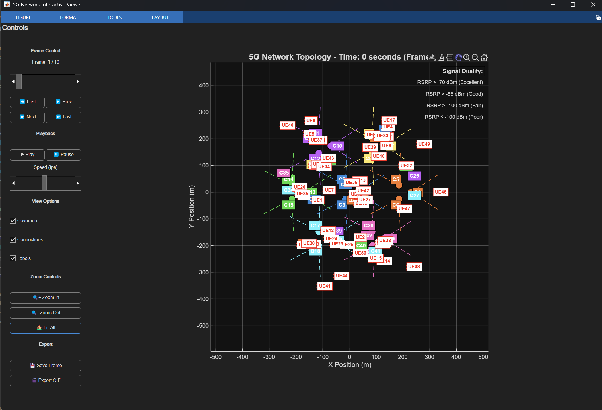
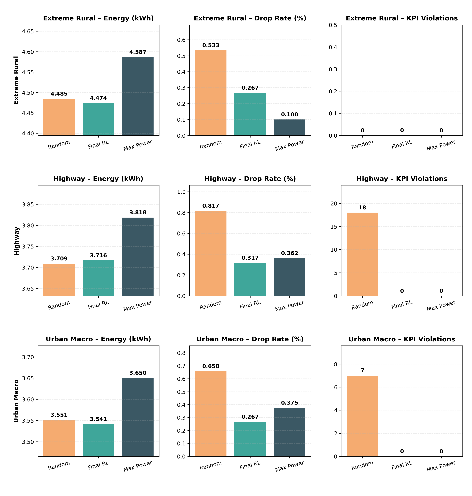

# **Autonomous 5G Power Control via Lagrangian PPO**

This project recreates the 5G Energy Saving Challenge in Python.
Each scenario simulates a 5G macro network with multiple cells and UEs.
The goal is to minimize total energy consumption **while keeping QoS metrics
(drop rate, latency, PRB/CPU) within KPI limits**.

5G base stations are responsible for **60–70% of a mobile operator’s energy consumption**;
even saving **2 %** at scale is economically significant.



---

## **Key Techniques**

* **Lagrangian PPO Agent** (`app/energy_agent/rl_agent.py`)
  Actor–critic with a dual variable balancing energy reward and QoS constraint violations.

* **State Augmentation & Normalization**
  Engineered global and per-cell features; running normalizer; dynamic padding for varying numbers of cells.

* **Parallel Simulation** (`SimpleParallelEnv`)
  Multiple environments in parallel for higher sample throughput.

* **Checkpointing & Visualization**
  Automatic saving/loading under `models/*.pth` and KPI plots per training episode.

---

## **How to Train**

1. Run `run.ipynb` **or** execute:

```bash
python app/main_run_scenarios_parallel.py
```

Set in `config.yaml`:

```yaml
training_mode: True
```

Checkpoints will be saved under `models/`.

---

## **How to Test / Evaluate**

```bash
cd app
docker build -t energy-simulation .
docker-compose run energy-simulation bash
```

Inside the container:

```bash
# set training_mode: False in config.yaml
./run_main_run_scenarios.sh /opt/mcr/R2025a | tee logs/output.log
```

---

## **Benchmark (Random vs Final RL vs Max Power)**

Run:

```bash
python app/benchmark_models.py \
  --scenarios-dir app/scenarios \
  --final-checkpoint models/final.pth \
  --csv-report reports/benchmark.csv
```

Results:

| Scenario      | Policy    | Energy (kWh) | Drop % | KPI Violations |
| ------------- | --------- | ------------ | ------ | -------------- |
| extreme_rural | Random    | 4.4846       | 0.53   | 0              |
|               | Final RL  | 4.4737       | 0.27   | 0              |
|               | Max Power | 4.5867       | 0.10   | 0              |
| highway       | Random    | 3.7090       | 0.82   | 18             |
|               | Final RL  | 3.7165       | 0.32   | 0              |
|               | Max Power | 3.8184       | 0.36   | 0              |
| urban_macro   | Random    | 3.5515       | 0.66   | 7              |
|               | Final RL  | 3.5415       | 0.27   | 0              |
|               | Max Power | 3.6504       | 0.38   | 0              |



---

## **Interpretation**

* Final RL policy eliminates KPI violations and reduces drop rate by **2×–3×**
  compared to the random baseline in heavy-load scenarios.
* Energy consumption is **2.4–3.0 % lower** than the max-power network
  while maintaining comparable latency.
* Random actions can occasionally save energy but create severe QoS violations,
  making RL the clearly superior option for real deployments.

